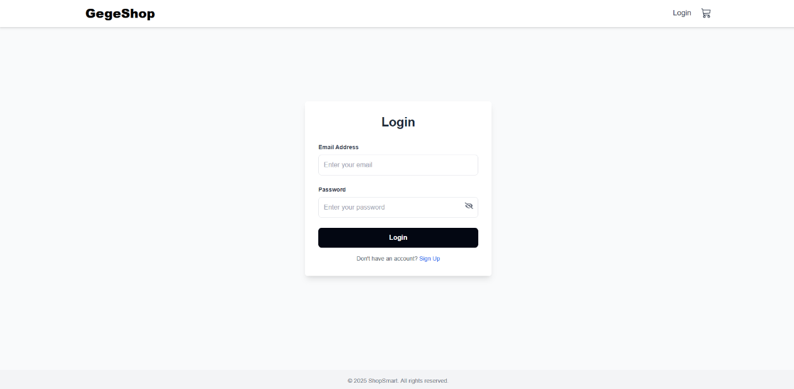
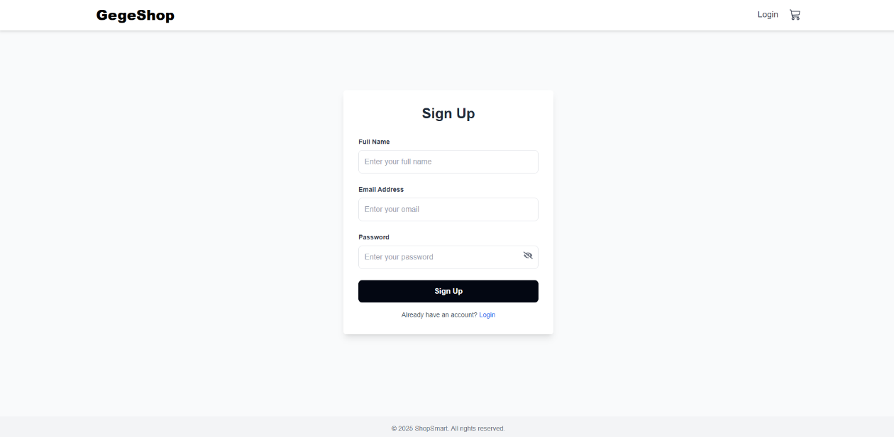
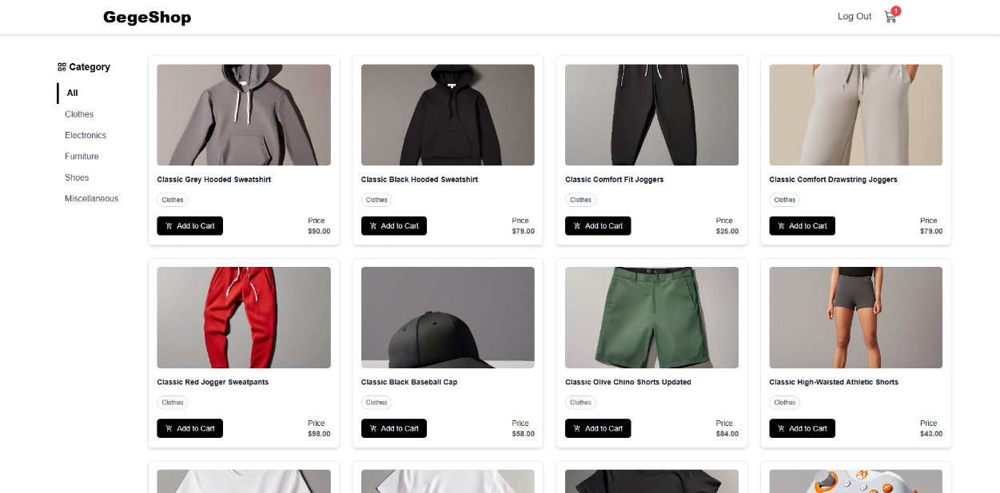
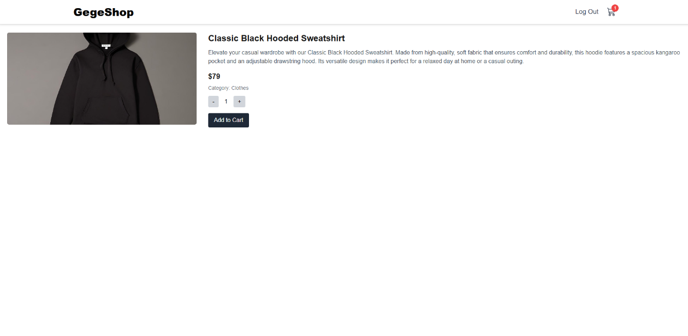
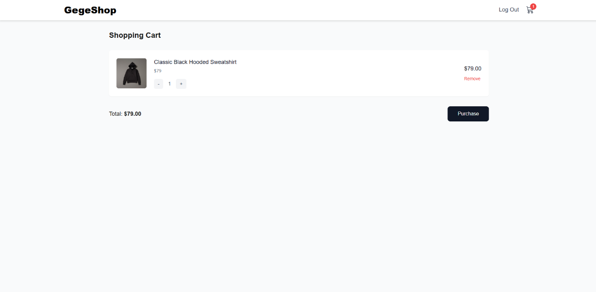

[](https://classroom.github.com/a/t4UX4h2e)

# GegeShop - E-Commerce Website

## Overview
GegeShop is a e-commerce website application built with Next.js. This project was created to fulfill the RevoU Module 5 assignment requirements.

## Live Demo
🌐 [Visit GegeShop](https://gegeshop.vercel.app/)

## Key Features 
### User Authentication
- Secure login system
- User registration/signup

### Product Management
- Filter products by categories
- View detailed product information
- Adjust product quantities
- Add items to shopping cart

### Shopping Cart
- Real-time cart management
- Adjust product quantities
- Remove items from cart
- Seamless checkout process

## Technologies Used
- **Frontend Framework:** Next.js
- **Styling:** Tailwind CSS
- **HTTP Client:** Axios
- **API Integration:** [Platzi Fake Store API](https://fakeapi.platzi.com/en/about/introduction/)
- **Deployment:** Vercel

## Getting Started

### Installation Steps
1. Clone the repository
   ```bash
   git clone https://github.com/revou-fsse-oct24/milestone-2-aizarfarhan25.git
   ```

2. Navigate to project directory
   ```bash
   cd module5
   ```

3. Install dependencies
   ```bash
   npm install
   ```

4. Start development server
   ```bash
   npm run dev
   ```

## Application Screenshots

### User Authentication
| Login Page | Sign Up Page |
|------------|--------------|
|||

### Shopping Experience
| Homepage | Product Detail | Shopping Cart |
|----------|----------------|---------------|
||||

## API Documentation
This project uses the Platzi Fake Store API for product data. For detailed API documentation, visit:
[Platzi API Documentation](https://fakeapi.platzi.com/en/about/introduction/)
